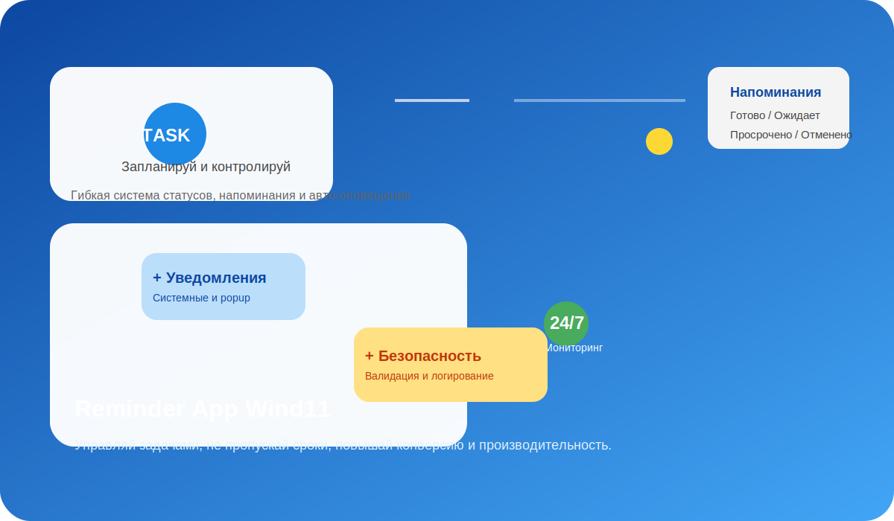
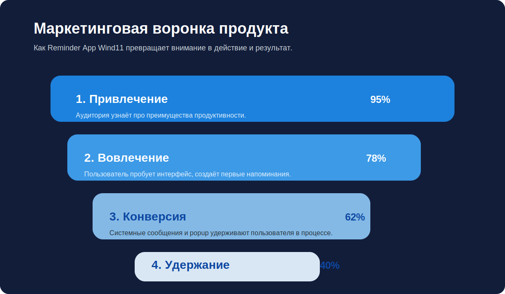

# Reminder App Wind11



> **Reminder App Wind11** — современное десктоп-приложение для Windows 11, созданное для профессионалов, менеджеров и предпринимателей, которые ценят своё время и ждут качественный цифровой инструмент для управления задачами.

---

## 🎯 О проекте

**Reminder App Wind11** — это решение для ежедневной продуктивности, построенное на Python и SQLite. Проект демонстрирует:

- модульную архитектуру и чистый код;
- устойчивое логирование и защиту от ошибок;
- удобный интерфейс в Tkinter;
- надёжные уведомления Windows 11 с fallback-сценарием;
- портфолио-уровень презентации: структура MVP и описание ценности.

Этот проект легко использовать и демонстрировать в профессиональном портфолио, потому что он показывает не только техническую реализацию, но и бизнес-фокус: пользовательский опыт, удержание и конверсию.

---

## 🚀 Бизнес-ценность

Reminder App Wind11 помогает коммерческим пользователям:

- повысить дисциплину и своевременность исполнения задач;
- сократить потери из-за просроченных событий;
- автоматизировать напоминания без дополнительных подписок;
- улучшить персональную эффективность и ROI времени.

Функции этого приложения идеально подходят для портфолио, так как демонстрируют:

- end-to-end разработку продукта;
- работу с локальной базой данных;
- интерфейс, ориентированный на desktop-пользователя Windows;
- работу с уведомлениями и пользовательскими сценариями.

---

## 🧩 Ключевые возможности

- ✅ Добавление напоминаний с заголовком, описанием и временем срабатывания
- ✅ Автоматизация статусов: **Ожидает**, **Готово**, **Просрочено**, **Отменено**
- ✅ Фильтрация списка по статусу
- ✅ Ручная отметка как выполнено или отменено
- ✅ Удаление напоминаний с подтверждением
- ✅ Системные уведомления Windows 11 через `win10toast`
- ✅ Резервный pop-up на Tkinter благодаря «fallback» механизму
- ✅ Фоновый мониторинг и авто-перевод в статус "Просрочено"
- ✅ Устойчивое логирование событий и ошибок
- ✅ Защита от неправильного ввода и валидация данных

---

## 📌 Архитектура

Проект организован по принципу **разделения ответственности**:

- `main.py` — точка входа, запуск приложения и управление жизненным циклом
- `database.py` — слой хранения и бизнес-правила для напоминаний
- `notifications.py` — уведомления, fallback-логика и фоновый мониторинг
- `gui.py` — визуальный интерфейс в Tkinter
- `logger.py` — файл логирования с ротацией
- `config.py` — централизованные константы и стили
- `assets/` — визуализация и маркетинговые графики

---

## 📈 Маркетинговая воронка продукта



### 1. Привлечение
Покажи продукт как инструмент высокой эффективности. Удели внимание мотиву: "Экономия времени, контроль процессов, отсутствие пропусков".

### 2. Вовлечение
Пользователь быстро видит интерфейс и сразу может создать первое напоминание. Простой путь от идеи до результата.

### 3. Конверсия
Уведомления и popup-система удерживают внимание. Приложение даёт уверенность, что важное событие не будет пропущено.

### 4. Удержание
При регулярном использовании пользователи возвращаются к приложению: оно строит доверие и повышает продуктивность.

---

## 💼 Почему это достойно портфолио

Reminder App Wind11 — это не просто «сделал приложение». Это демонстрация:

- продуктового мышления;
- технической зрелости;
- внимания к UX и пользовательскому опыту;
- корректной архитектуры;
- сильной документации и брендированной презентации.

Проект демонстрирует, что вы умеете создавать приложения, которые уже готовы к полноценному использованию, а не только к разработке.

---

## 🛠 Технологии

- Python 3.7+
- Tkinter
- SQLite3
- win10toast
- Logging (RotatingFileHandler)

---

## 📁 Структура проекта

```
reminder_appWind11/
├── assets/                # Маркетинговые графики и иллюстрации
├── config.py              # Конфигурация и константы
├── database.py            # Работа с SQLite3
├── gui.py                 # Интерфейс приложения
├── logger.py              # Настройка логирования
├── main.py                # Точка входа
├── notifications.py       # Система уведомлений
├── README.md              # Данное портфолио-описание
├── requirements.txt       # Зависимости
├── run.bat                # Быстрый запуск на Windows
└── reminder_app.log       # Логи выполнения
```

---

## ⚡ Как запустить

### 1. Установите зависимости

```bash
pip install -r requirements.txt
```

### 2. Запустите приложение

```bash
python main.py
```

### 3. Вариант для Windows

Откройте `run.bat` двойным кликом.

---

## 🧪 Защита и устойчивость

Reminder App Wind11 включает:

- **валидацию заголовка** — пустые задачи не сохраняются;
- **валидацию времени** — формат `YYYY-MM-DD HH:MM:SS` обязательно проверяется;
- **обработку исключений** — ошибки работы с БД и UI логируются и не ломают приложение;
- **устойчивое логирование** — `reminder_app.log` сохраняет события и ошибки;
- **fallback-уведомления** — если системные уведомления Windows недоступны, система показывает popup.

---

## ✍️ Основные сценарии

### Добавление задачи
1. Нажмите **➕ Добавить**
2. Введите заголовок
3. Укажите описание
4. Установите дату и время
5. Нажмите **💾 Сохранить**

### Быстрое напоминание
Нажмите одну из кнопок:
- **1 мин**
- **5 мин**
- **15 мин**
- **1 час**

### Управление задачами
- **✅ Готово** — завершить задачу
- **❌ Отменить** — отменить задачу
- **🗑️ Удалить** — удалить задачу
- **🔄 Обновить** — пересчитать и отобразить список

---

## 📌 Примеры логирования

Файл `reminder_app.log` фиксирует:

- старт приложения
- создание напоминаний
- ошибки добавления и обновления
- аварийные ситуации
- работу фонового мониторинга

---

## ✅ Результат

Reminder App Wind11 — это полноценный рабочий проект, готовый для показа заказчику или работодателю.

Он отражает сильные стороны разработки:

- стабильность;
- удобство использования;
- архитектурную чистоту;
- маркетинговый подход;
- профессиональное портфолио-описание.

---

**Reminder App Wind11 — система напоминаний, которая превращает ваши задачи в результаты.**
